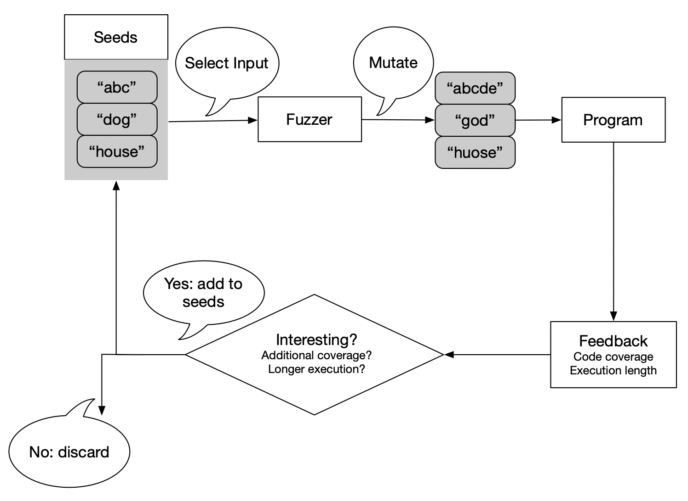

## Objective

In this lab, you will develop a _fuzzer_ for testing C programs.
Fuzzing is a popular software testing technique wherein the program under test
is fed randomly generated inputs. Such inputs help uncover a wide range of
security-critical and crashing bugs in programs.
For this purpose, your fuzzer will begin with seed inputs, and generate new
inputs by mutating previous inputs. It will use output from previous rounds
of test as _feedback_ to direct future test generation.
You will use the code coverage metrics you saw in Lab 2 to help select interesting
inputs for your fuzzer to mutate.

You will extend and evaluate this fuzzer through three components:

1. **Implementing research ideas:** build a static dictionary and apply its
   tokens using ideas from [Static Program Analysis as a Fuzzing Aid][static-aid-paper],
   implement the comparison-tracing stage of [REDQUEEN][redqueen-paper], and
   assign mutation budgets using [AFLFast][aflfast-paper].
2. **LLM-generated seeds:** use a large language model (LLM) to generate a
   varied JSON seed corpus, validate it, and submit it with your fuzzer.
3. **Real-world case studies:** evaluate your fuzzer on the provided JSON
   parser and compare baseline coverage with coverage using your submitted
   seeds. The grader also evaluates generalization on three hidden libraries.

## Pre-Requisites

+ Watch the video lectures corresponding to the module on “Random Testing”.
  The lectures introduce various terminology used throughout this lab
  such as seed inputs, mutations, and feedback-directed testing.
+ Read the three papers below. Each implements a mechanism that you will
  adapt in this lab; the corresponding section under
  [Lab Instructions](#lab-instructions) says which parts of each paper to
  focus on and specifies the exact scope, interfaces, and byte formats of the
  adaptation.

| Paper | Mechanism implemented in this lab |
| --- | --- |
| Shastry et al., [Static Program Analysis as a Fuzzing Aid][static-aid-paper], RAID 2017 | Extract dictionary tokens from program code and use them in insertion/overwrite mutations |
| Aschermann et al., [REDQUEEN: Fuzzing with Input-to-State Correspondence][redqueen-paper], NDSS 2019 | Trace the operands of executed comparisons using LLVM instrumentation |
| Böhme, Pham, and Roychoudhury, [Coverage-based Greybox Fuzzing as Markov Chain][aflfast-paper], CCS 2016 | Apply the FAST power schedule to allocate mutations to a selected seed |

## Setup

The code for Lab3 is located under `cis547vm/lab3`.
We will frequently refer to the top level directory for Lab 3 as `lab3`
when describing file locations for the lab.
Open the `lab3` directory in VSCode following the Instructions from [Course VM document][course-vm]

This lab builds off the code coverage instrumentation from Lab 2.
You are provided with an `InstrumentDivision.cpp` file in `lab3/src`;
it contains two instrumentations, namely coverage and sanitize.
You have already seen code coverage in the previous lab and the implementation
here is identical to it.
In lab 1, you have seen that when a program encounters a divide-by-zero error it causes a Floating Point Exception and leads to a core dump.
The sanitizer instrumentation inserts a call to the `__sanitize__` function
before every division instruction.
This function gracefully exits the program with return code `1`
if the denominator is zero, otherwise the program continues running normally.
The provided pass performs the zero comparison at the denominator's native
integer width, including for 64-bit divisions, before calling the runtime.

### Step 1. Build the fuzzer and instrumentation

The fuzzer and instrumentation are built using CMake. First, create a build
directory and build each component manually:

```sh
lab3$ mkdir build && cd build
lab3/build$ cmake ..
lab3/build$ make
```

After running `make`, you should notice `FuzzingAnalysis.so`,
`libruntime.so`, and `fuzzer` in `lab3/build`.
The `fuzzer` is the tool that will feed randomized input (that you will generate)
to a compiled C program that was instrumented to exit gracefully
when it hits a Divide-by-Zero error and report code coverage during execution.

For later builds, you can run the same CMake steps from the top-level `lab3`
directory with `make build`.

### Step 2. Prepare a test program

Next, we want to prepare a test program to fuzz with the `fuzzer`.
This will be done by first compiling it to LLVM IR, instrumenting the IR as in
Lab 2, and then linking the instrumented program with the runtime. Run each
step manually once:

```sh
lab3/test$ clang -emit-llvm -S -fno-discard-value-names -c -o sanity1.ll sanity1.c -g
lab3/test$ opt -load-pass-plugin=../build/FuzzingAnalysis.so -passes="FuzzingAnalysis" -S sanity1.ll -o sanity1.instrumented.ll
lab3/test$ mv fuzzing_dict fuzzing_dict_sanity1
lab3/test$ clang -o sanity1.out -L../build -Wl,-rpath,../build -lruntime -lm sanity1.instrumented.ll
```

The result is `sanity1.out`, along with its LLVM IR and the extracted
`fuzzing_dict_sanity1/` directory. The supplied test Makefile performs the same
steps. Use the original target name to build just `sanity1`, or `all` to build
every public target:

```sh
lab3/test$ make sanity1
lab3/test$ make all
```

### Step 3. Run the fuzzer

You may recall from lab 1, that AFL could generate new inputs forever and never
stop running. This is also the case for your fuzzer.
So for this we will use `timeout` to stop the fuzzer after a specified time.

First, create the output directory where the fuzzer will store its results:

```sh
lab3/test$ mkdir fuzz_output_sanity1
```

Then run your fuzzer on `sanity1.out` for one second. The options below match
the supplied `config.txt` and use the dictionary extracted above:

```sh
lab3/test$ timeout 1s ../build/fuzzer ./sanity1.out fuzz_input fuzz_output_sanity1 \
  --freq 1000 --seed 42 --dict fuzzing_dict_sanity1
```

The `./` before `sanity1.out` is required so the fuzzer can find the
executable. The `seed` setting controls the random-number generator, while
`freq` controls how often the fuzzer writes a non-crashing input (larger values
are less frequent).

For later runs, `test.sh` removes and recreates the output directory and reads
the random seed and feedback frequency from `lab3/config.txt`:

```sh
lab3/test$ ./test.sh sanity1 1s
```

You can also use the Makefile to build the target and run the harness for ten
seconds:

```sh
lab3/test$ make fuzz-sanity1
```

Either way, the results are stored in `lab3/test/fuzz_output_sanity1`.
Once you have run the `fuzzer` you should expect to see the `failure` directory
get populated with several randomly generated inputs that crash `sanity1.c`.
You may also see some of the randomly generated inputs that don't
cause a crash under the `success` directory.

```
fuzz_output_sanity1
├── success         # Some of the generated inputs that didn't cause a crash.
│   ├── input0
│   └──  ...
├── randomSeed.txt  # The seed that was used to generate random numbers.
└── failure         # All the generated inputs that cause a crash.
    ├── input0
    ├── input1
    │    ...
    └── inputN
```

Here `N` is the last case that caused a crash before the timeout.

## Lab Instructions

A full-fledged fuzzer consists of three key features:

1. test case generation matching the grammar of the program input,
2. strategies to mutate test inputs to increase code coverage,
3. a feedback mechanism to help drive the types of mutations used.

### Overview of the Tasks

The implementation work is in `src/Fuzzer.cpp`, `src/Utils.cpp`,
`src/BuildDictionary.cpp`, `src/DictionaryMutation.cpp`,
`src/InstrumentComparisons.cpp`, and `src/PowerSchedule.cpp`. It falls into
three parts, and the sections below
walk through them in the same order.

**Part 1: the core fuzzer** (`src/Fuzzer.cpp` and `src/Utils.cpp`)

1. Implement `selectInput`, which selects a parent string from the
   `SeedInputs` vector.
2. Implement mutation functions that help your fuzzer generate a rich variety
   of strings, and implement `selectMutationFn` to decide which mutation
   function to pick.
3. In `feedback`, decide whether a mutation was interesting based on the
   success or failure of the program and its code coverage, and insert
   interesting mutants into `SeedInputs` to drive further mutation.
4. Make sure `runTarget` passes every generated input to the target program
   correctly.

**Part 2: the paper adaptations**

5. Paper 1: implement constant extraction to build a dictionary of keywords
   (`src/BuildDictionary.cpp`), implement the dictionary application contract
   in `applyDictionaryEntry` (`src/DictionaryMutation.cpp`), and use it from
   the dictionary-driven mutations.
6. Paper 2: instrument supported comparisons and pass their runtime operands
   to the provided logging hooks (`src/InstrumentComparisons.cpp`).
7. Paper 3: implement the FAST energy rule and shared scheduling state
   (`src/PowerSchedule.cpp`), and spend the mutation budget in `fuzzOneBatch`.

**Part 3: seeds and real-world evaluation**

8. Use an LLM to generate JSON seeds, review and validate them, and place the
   final corpus in `json_seeds/`.
9. Run the public JSON case study and compare baseline and submitted-seed
   coverage in the grader's real-world evaluation.

Each paper adaptation has a public `make check-*` target, described in its
section, that exercises the required behavior on a fixed input.

### Mutation-Fuzzing Primer

Consider the following code that reads some string input from the command line:

```c
int main() {
  char input[65536];
  fgets(input, sizeof(input), stdin);
  int x = 13;
  int z = 21;

  if (strlen(input) % 13 == 0) {
    z = x / 0;
  }

  if (strlen(input) > 100 && input[25] == 'a') {
    z = x / 0;
  }

  return 0;
}
```

We have two very obvious cases that cause divide-by-zero errors in the program:

+ If the length of the program input is divisible by 13, or
+ if the length of the input is greater than 100 and the 25th character in the string is an `a`.

Now, let’s imagine that this program is a black box, and
we can only search for errors by running the code with different inputs.

We would likely try a random string, say `"abcdef"`, which would give us a successful run.
From there, we could take our first string as a starting point and
add some new characters,`"ghi"`, giving us `"abcdefghi"`.
Here we have mutated our original input string to generate a new test case.
We might repeat this process, finally stumbling on “abcdefghijklm”
which is divisible by 13 and causes the program to crash.

How about the second case?
We could keep inserting characters onto the end of our string,
which would eventually get us some large string that satisfies
the first condition of the if statement (input length greater than 100),
but we need to perform an additional type of mutation ---
randomly changing characters in the string ---
to eventually satisfy the second condition in the if statement.

Through the use of various mutations on an input string, we were able to
exhaust all program execution paths,
i.e., more varied mutations in the input increased our code coverage.
In its simplest form, this is exactly what a fuzzer does.
You may take a look at the [Mutation-Based Fuzzing][fuzzing-book-mutation] chapter in the Fuzzing Book.

### Feedback-Directed Fuzzing

We’ve seen how randomized testing can find bugs and is
a useful software analysis tool.
The previous section describes a brute force generation of test cases;
we simply perform random mutations hoping that we find a bug.
This results in a lot of test cases being redundant, and therefore unnecessary.

We can gather additional information about a program’s execution and
use it as _feedback_ to our fuzzer.
The following figure shows at a high level what this process looks like:



Generating new, interesting seeds is the goal of feedback directed fuzzing.
What does _interesting_ mean?
We might consider whether a test increases code coverage.
If so, we have found new execution pathways that we want to continue to explore.
Another test might significantly increase program runtime, in which case
we might discover some latent performance bugs.
In both cases, the tests increased our knowledge of the program;
hence, we insert these tests into our set of seeds and use them as a
starting point for future test generation.

Feel free to check out the [Greybox Fuzzing][fuzzing-book-greybox] chapter in the Fuzzing Book.

### Building the Fuzzer

In this lab, you will modify `src/Fuzzer.cpp` to build a coverage guided fuzzer.
You'll need to implement some variety of mutation functions; a mutation function
takes a string, performs some mutation on it, and returns the mutated string.
You will have to decide which mutation strategies to choose and you will
implement your logic in `selectMutationFn`.
It may help to look at the test programs in `test/` to see what sort of
programs your fuzzer would have to explore to find bugs, and what sort of
mutations you might want to perform.

The fuzzer will start by reading input files from the input directory
specified on the command line to initially populate the `SeedInputs` vector.
After that, it will need to select a particular input from the
`SeedInputs` vector and a mutation function that will be used to mutate it.
For this, you will need to implement your logic for
`selectInput`, and `selectMutationFn` respectively.
The fuzzer first executes each distinct initial seed once to record its coverage.
For each later seed selection, it obtains an energy budget from the power
scheduler (see [Paper 3](#paper-3-aflfast-power-scheduling)) and generates
that many mutations from the selected parent. It may
choose a different mutation function on each iteration.
The mutated input will be run on the target program, and feedback will be
provided based on the coverage of that run.
Using this coverage, you will then decide if this is an _interesting_ seed
and insert it into the `SeedInputs` vector if you find it so.
This allows the mutated input to be picked later on and be further mutated.
This process continues until the fuzzer gets interrupted
(via timeout, or on the terminal by Ctrl+C).

The following pseudo-code illustrates this logic:

```
readSeedInputs(SeedInputs)                // Initialize SeedInputs
calibrateSeedInputs(Target, OutDir)       // Record initial coverage and frequency

while (true) {
  input <- selectInput()                 // Pick one parent
  energy <- PowerScheduler.nextEnergy(input)
  repeat energy times {
    mutation <- selectMutationFn()
    mutatedInput <- mutation(input)      // Always start from the chosen parent
    test(Target, mutatedInput)
    feedBack(Target, mutatedInput)       // Account for every execution
  }
}
```

Refer to `fuzz` and `fuzzOneBatch` in `src/Fuzzer.cpp` for this logic.

#### Code Coverage Metric

Recall that you have a way of checking how much of a particular program gets
executed using the coverage information output by the instrumentation.
A `.cov` file will get generated in the working directory for the program
that is getting fuzzed. This file is read and is made available to you
through `RawCoverageData` variable inside the `feedback` function.
You can then use it to decide if a particular mutation is interesting.

#### Possible Mutations

The following is a list of potential suggestions for your mutations:

+ Replace bytes with random values.
+ Swap adjacent bytes.
+ Cycle through all values for each byte.
+ Remove a random byte.
+ Insert a random byte.

We also give placeholders for two dictionary-driven mutations,
`mutationDictDeterministic` and `mutationDictRandom`. Use `applyDictionaryEntry`
(see [Paper 1](#paper-1-static-program-analysis-as-a-fuzzing-aid)) to apply
their chosen tokens.

Feel free to play around with additional mutations, and see if you can speed up
the search for bugs on the binaries.
You may use the C++ function `rand()` to generate a random integer.

You will notice that different programs will require different strategies,
or that in some cases you may even have to switch between different mutation
strategies in the middle of the fuzzing process.
You are expected to include a mechanism that will try to choose the best
strategy for the input program based on the coverage feedback.

#### A Few Tips

Read through the Notes, Hints, and Comments in `Fuzzer.cpp` file
before you start, to get a better idea of how everything fits together.

Start small.
Implement one mutation strategy at a time and try to crash the
easier test cases first before moving to harder ones.
Once successful, you can move on to implementing more strategies and
more sophisticated ways of choosing between them based on the feedback you get.

Do not be afraid to keep track of any state between rounds of the fuzzing.

You may want to try each of your mutation strategies initially to see
which one generates a test that increases code coverage,
and then exploit that strategy.

### Paper 1: Static Program Analysis as a Fuzzing Aid

Fuzzing dictionaries are lists of keywords and magic numbers that guide fuzzers toward generating more meaningful test inputs.
Dictionary-guided fuzzing incorporates domain-specific knowledge to increase the likelihood of triggering interesting program behaviors.
These dictionaries might contain file format signatures (for a image processing library), keywords (for a compiler), and more.
Dictionaries can significantly improve code coverage and bug-finding ability compared to less-informed approaches.

Static analysis offers an opportunity for automatically extracting dictionary entries from target programs.
We can analyze the LLVM IR to identify string literals, integer constants, and comparison operands.
For instance, if the code contains a comparison like `if (header == 0xFEED)`, static analysis can extract `0xFEED` and add it to the fuzzing dictionary.
This automated extraction process can discover constants that would be nearly impossible for random fuzzing to generate.

We can also extend the dictionary with position hints, specifying where certain tokens should appear.
These hints might indicate that certain magic bytes must appear at specific offsets.
By encoding positional constraints alongside the dictionary tokens themselves, we can more efficiently generate structurally valid inputs.

Shastry et al. use static analysis to infer useful input constructs and supply
them to dictionary-driven mutations. Focus on Sections 3.1–3.2 of the paper
and its dictionary-mutation algorithm. Implement a local LLVM IR adaptation of
this workflow, including the dictionary application task below. The paper's
Orthrus prototype uses Clang AST queries and broader interprocedural analysis;
the lab specifies local extraction rules. Position hints, integer-neighbor
rules, and the exact output format below are course-specific requirements.

#### Building the Dictionary

Modify `src/BuildDictionary.cpp` to implement a local LLVM analysis
that automatically builds a dictionary for your fuzzer. The pass must write a
flat `fuzzing_dict` directory. Each file is named `entry_N` for an unpositioned
token or `entry_N@offset` for a token that should be placed at the given
nonnegative byte offset. File contents are the raw token bytes; they are not
text escapes or C strings. Filenames and enumeration order have no semantic
meaning.

Your dictionary construction must implement the following behavior:

+ Extract flat global `[N x i8]` initializers.
  Think about how a C string literal ends up as a global array in LLVM IR,
  and what that implies about a trailing byte you probably don't want in
  the dictionary.
+ For `icmp` instructions over `i8`, `i16`, `i32`, or `i64`, serialize constants
  in the byte order declared by the module. Equality and inequality comparisons
  contribute the exact constant.
  Ordered comparisons (`<`, `<=`, `>`, `>=`) tell a fuzzer about a boundary
  rather than a single value; consider which constants near `C` are worth
  contributing, and how to avoid wrapping at the type's signed or unsigned
  limits.
+ Extract every explicit `switch` case value. The default destination does not
  contribute a value.
+ Recognize direct calls to `strcmp`, `strncmp`, `memcmp`, and `strstr`, including
  constant operands reached through constant GEPs and pointer casts.
  These four functions don't all agree on how much of the constant operand
  is meaningful. Check each function's signature and NUL-termination
  behavior — in particular, `strncmp` takes a length argument as well as two
  pointers.
+ Attach a position hint only for the documented local cases: an `i8` loaded
  directly (and optionally extended once) from a constant-offset GEP into a
  local byte-array allocation, or a direct constant-offset input-buffer
  argument to `strcmp`, `strncmp`, or `memcmp`. Entries whose positions cannot
  be established locally must remain unhinted. `strstr` entries are unhinted.

You may emit additional entries when they obey the format. Every entry must be
between 1 and 1024 bytes, every hint must be a nonnegative decimal integer, and
the output must not contain duplicate `(bytes, hint)` pairs. Your implementation
must remain bounded and must not create links, directories, or unrelated files
inside `fuzzing_dict`.

PHI nodes, selects, dynamic offsets, aliases, wrapper functions, nested
aggregate initializers, interprocedural reasoning, and general provenance
tracking are outside the required scope.

The plugin exposes two new-pass-manager pipelines. `BuildDictionary` runs only
dictionary construction, while `FuzzingAnalysis` retains the combined
dictionary-and-instrumentation behavior used by the provided test Makefile.
The starter helper functions compile but are only scaffolding; the behavior
specified above is required.

You can build the lab and run a representative public semantic check with:

```sh
lab3$ make check-dictionary
```

The check runs `BuildDictionary` on `test/dictionary_public.ll`, validates the
directory and entry bounds, normalizes entries as `(raw bytes, optional hint)`,
and checks representative globals, integer boundaries, switches, comparison
calls, binary slices, and local hints. Additional well-formed entries are
permitted.

#### Applying Dictionary Entries

The paper's mutation algorithm consumes extracted dictionary entries
through insertion and overwrite. Implement this step with the explicit byte
semantics below so that extraction and application can be checked separately.

Implement `instrument::applyDictionaryEntry` in `src/DictionaryMutation.cpp`
and use it from your dictionary mutation strategies in `src/Fuzzer.cpp`.
Keep its declaration in `include/DictionaryMutation.h` unchanged, and keep the
operation self-contained: it receives the input, dictionary entry, offset, and
insertion/overwrite choice as arguments, and must not depend on the fuzzer's
global state or randomness.

The application contract is:

+ A position hint overrides the supplied offset, including when the hint is
  zero. Without a hint, the offset must be between zero and the input length,
  inclusive; larger offsets return the original input unchanged.
+ When a hint is beyond the input's end, pad to that position with NUL bytes
  before applying the token.
+ Insertion puts the entire token at the selected position and preserves the
  original suffix. Overwrite replaces up to the token's length starting at that
  position, extending the input if necessary. Both operations accept an empty
  input and a position exactly at the end.
+ Preserve every byte in both the input and token, including embedded/trailing
  NULs and bytes above `0x7f`.
+ Tokens must contain 1 through 1024 bytes. The original and resulting inputs
  must each be at most 64 KiB. Invalid tokens, oversized original inputs, or
  operations exceeding that limit return the original input unchanged, with no
  padding or partial mutation. Check bounds before adding sizes, converting
  position hints, or allocating memory; hints may span all of `uint64_t`.

For example, inserting `XY` into `abcd` at offset 2 produces `abXYcd`;
overwriting at that offset produces `abXY`. Overwriting with `XYZ` at offset 3
produces `abcXYZ`. A token `Z` hinted at offset 3 applied to `a` produces the
four bytes `a`, NUL, NUL, `Z`.

Run a representative public check with:

```sh
lab3$ make check-dictionary-application
```

Strategies remain free to select entries, offsets, and insertion/overwrite
modes. A strategy can explicitly discard a hint when exploring another position
by passing a copy with `positionHint = std::nullopt`.

### Paper 2: REDQUEEN Comparison Tracing

Aschermann et al.'s REDQUEEN observes comparison operands to support
input-to-state correspondence. Focus on the tracing stage in Section III-A of
the paper and how its observations support input-to-state correspondence.
Implement that stage using LLVM instrumentation: `ComparisonLogging` in
`src/InstrumentComparisons.cpp` calls the provided runtime in `lib/cmplog.c`
to record both operands of comparisons that execute. Preserve their pairing,
including values computed at runtime. The [CmpLog documentation][cmplog-docs]
provides related practical background.

This task grades operand collection. REDQUEEN's further stages include input
colorization, correspondence-based mutation generation, and checksum handling;
these are outside the required implementation. The lab's LLVM pass, supported
instruction set, and bounded log format are teaching adaptations.

#### Instrumented Instructions

Your pass must instrument these original instructions, including instructions
without debug locations:

+ Scalar integer `icmp` instructions with 8-, 16-, 32-, or 64-bit operands,
  for every comparison predicate. Pass the original width and zero-extend
  each operand to 64 bits for the runtime call. Signed operands retain their
  original two's-complement bit patterns.
+ Direct `strcmp`, `strncmp`, and `memcmp` calls, including callees reached
  through pointer casts. The supported calls return `i32` and take two
  address-space-zero pointers; bounded calls also take a 32- or 64-bit integer
  length. Preserve the original call and its result.

Pointer, vector, floating-point, and other-width comparisons, indirect calls,
and `invoke` instructions are outside the required scope. Skip functions whose
names start with `__cmp_log`, along with the supplied `__coverage__`,
`__sanitize__`, and `get_logfile` runtime functions.
Each supported instruction must record its operands immediately before it
executes. A comparison in a branch that is not reached produces no record.

#### Runtime Hooks and Log Format

The supplied runtime exports these hooks:

```c
void __cmp_log_int(uint32_t width, uint64_t lhs, uint64_t rhs);
void __cmp_log_bytes(uint32_t kind, const void *lhs, const void *rhs, uint64_t n);
```

The byte hook uses kind 1 for `strcmp`, 2 for `strncmp`, and 3 for `memcmp`.
Pass the actual runtime length for bounded calls; `strcmp` ignores `n`.
The runtime implements the following output contract:

+ Logging is enabled by a nonempty `LAB3_CMPLOG_PATH` environment variable.
  Each target process creates or truncates that file at startup, including
  executions that reach no comparisons.
+ Each line has four tab-separated fields: `kind`, `width`, `lhs`, and `rhs`.
  Kinds are `icmp`, `strcmp`, `strncmp`, and `memcmp`. Width is the integer bit
  width for `icmp` and zero for library comparisons. Operands use lowercase
  hexadecimal, with `-` representing an empty byte sequence.
+ Integer bytes use little-endian order in the log, independent of the host
  byte order. Each operand contains exactly `width / 8` bytes.
+ `strcmp` records up to 64 bytes from each string, stopping before its first
  NUL. `strncmp` also respects the runtime bound `n`. `memcmp` records exactly
  `min(n, 64)` bytes from each operand, preserving embedded NULs. A zero bound
  reads neither operand and records an empty pair.
+ Exact duplicate records are emitted once per process. After the first
  4096 distinct records, further records are ignored. These are single-threaded
  executions; valid buffers are supplied for every comparison.

For example, `memcmp(input + 2, "MAG!", 4)` with input `zzAAAA` produces:

```text
memcmp\t0\t41414141\t4d414721
```

Here `\t` denotes a tab. Run the public fixed-input check with:

```sh
lab3$ make check-cmplog
```

The checker instruments a supplied fixture, runs fixed inputs, and checks the
paired operand bytes and preserved program behavior. Record order is ignored;
process addresses and input-offset hints are not part of the format.

The `ComparisonLogging` pipeline runs independently. To combine it with
dictionary extraction and division/coverage instrumentation, use
`-passes=ComparisonLogging,FuzzingAnalysis`. The ordinary crash and coverage
campaigns use `FuzzingAnalysis`; runtime logging is checked with fixed inputs.
Using these comparison records to generate replacement mutations is an optional
extension.

### Paper 3: AFLFast Power Scheduling

Read Algorithm 1 and the FAST schedule in Section 4.1 of the
[AFLFast paper][aflfast-paper], Equation (4). Seed selection and power
scheduling are separate decisions: seed selection chooses which seed to mutate,
while power scheduling assigns its energy, the number of mutations to generate
before selecting another seed. Implement the fixed-base, bounded adaptation
below in `src/PowerSchedule.cpp` and connect it to `fuzzOneBatch` in
`src/Fuzzer.cpp`. Preserve the public interfaces in `include/PowerSchedule.h`,
the global `PowerScheduler`, and the
`fuzzOneBatch(std::string&, std::string&, RunInfo&)` entry point.
Also preserve `SeedInputs`, `MutationFns`, and the existing `RunInfo` fields.
The deterministic checker supplies corpus entries, mutation functions, and the
target interfaces declared in `Utils.h` through these interfaces.

#### Energy Calculation

Derive `assignEnergy` from FAST Equation (4). For this lab, use a fixed base
factor of 16 in place of the paper's `alpha(i) / beta` term and a maximum budget
of 64 mutations. Treat an unobserved signature as having frequency one, round
the resulting energy down to an integer, and give a registered seed at least
one mutation per selection.

The `priorSelections` argument counts previous selections of this seed, so its
first selection uses zero. `pathFrequency` counts executions with the seed's
coverage signature. Both arguments are unsigned 64-bit integers; every value
is valid.

| Prior selections `s` | Frequency `f` | Energy |
| ---: | ---: | ---: |
| 0 | 0 | 16 |
| 0 | 3 | 5 |
| 2 | 8 | 8 |
| 6 | 1 | 64 |

#### Scheduling State

The provided `makeCoverageSignature` helper sorts and deduplicates coverage
entries while preserving their bytes. This set of line/column observations is
the lab's approximation of the path information used by AFLFast. Empty coverage
is a valid signature. Seed identity is its complete byte string, including NULs;
distinct seeds can share a signature and therefore share its frequency.

Implement these `PowerSchedule` operations:

+ `registerSeed(input, signature)` records a new seed's normalized signature
  and initializes its selection count to zero. Re-registering the same bytes
  preserves the first signature and existing count. Registration never counts
  an execution.
+ `observeExecution(signature)` increments that normalized signature's shared
  frequency, even when no registered seed uses it. Count every execution,
  including crashing inputs and mutations that are discarded.
+ `nextEnergy(input)` computes energy from the seed's prior selection count
  and current shared frequency, then increments its selection count once.
  An unknown seed returns zero without changing state.
+ `selectionCount(input)` and `pathFrequency(signature)` return the relevant
  count; unknown inputs or signatures return zero without creating records.

All counters saturate at `UINT64_MAX`. The supplied calibration code executes
each distinct initial seed once, records that execution, and registers the seed.
Calibration consumes no selection and no mutation budget. The supplied feedback
bookkeeping records every later execution and registers newly retained inputs;
registration must not double-count those executions. Retain this bookkeeping
when customizing feedback or corpus admission.

#### Spending a Mutation Budget

Complete `fuzzOneBatch` so it selects one parent, obtains its energy once, and
executes exactly that many mutations. Keep the parent bytes and budget fixed
for the entire batch, even when feedback changes frequencies or grows the
corpus. Each mutation starts from that parent, and every execution receives
feedback. A zero budget performs no mutations. `fuzz` calibrates the corpus
and repeatedly invokes this same batch function.

Run the public energy and state checks with:

```sh
lab3$ make check-power-schedule
```

Scheduling is scored independently of crash-finding performance.

### LLM-Generated JSON Seed Corpus

Use an LLM of your choice to generate candidate seed inputs for the provided
JSON parser. LLM use for this task is required. Review the generated documents,
correct or regenerate invalid candidates, and select a varied final corpus of
between one and 30 seeds. You generate the seeds before submission; the course
environment does not run a language model during submission or grading.

Ask the model for JSON documents covering different value types, nesting
patterns, string escapes, numeric forms, and combinations of objects and
arrays. Refine your prompts to address gaps in the corpus. Save each selected
document as raw JSON, without Markdown fences or explanatory text.

Put one JSON document in each file under `lab3/json_seeds/`. Files must
be immediate, non-symbolic-link regular files with a lowercase `.json` suffix;
dotfiles are ignored, the directory may contain at most 256 total entries, and
other entries make the seed directory invalid.

The grader considers the files in deterministic bytewise filename order. Each
file must be nonempty, contain no NUL byte, and be at most 64 KiB. Duplicate
contents count once, and every distinct input must be accepted by the exact
vendored JSON parser. A file byte-identical to the fixed seed already in
`test/benchmark_input/json/` is considered but is not counted as an accepted
submitted seed or added to the augmented corpus.

Validate your corpus against the provided parser before submission:

```sh
lab3$ make validate-json-seeds
```

The submitted corpus is used only with the public JSON coverage target. It is
never passed to the three hidden real-world targets.

### Real-World Case Studies and Coverage Evaluation

The lab includes the real
[json-parser library at `8ac4477a`][json-parser-pin], its BSD license notice, a
bounded standard-input harness, and a deterministic seed. The JSON parser is a
coverage target and is not expected to contain an injected divide-by-zero
error. You can run a 30-second local campaign from `lab3/test` with:

```sh
make fuzz-json_parser_benchmark
```

This command uses the fixed starter corpus. To try your LLM-generated corpus
locally after validation, run from `lab3/test`:

```sh
./test.sh json_parser_benchmark 30s ../json_seeds
```

The local runs let you inspect your fuzzer's behavior on a real parser. Each
run replaces the previous output for this target. The grader computes the
coverage comparison below, combining your accepted seeds with the fixed seed
for its submitted-seed campaign.

After the scored tests, the autograder repeats that public campaign and runs
three grader-only holdout campaigns over other real-world text-processing
libraries. Their identities, formats, and fixed seed corpora are deliberately
withheld so the holdouts measure whether your approach generalizes beyond
JSON.

The baseline campaign for each target runs for 30 seconds with grader-owned seed
`42` and feedback frequency `1000`. The public JSON target then runs a second
time with its fixed seed augmented by your accepted `json_seeds/` files. Hidden
targets run only with their grader-owned fixed seeds and never receive your
submitted corpus. All campaigns use your LLVM instrumentation pass to drive the
fuzzer while Clang's source-based coverage records the library lines reached by
every execution. The leaderboard reports these descending columns:

1. `Submitted-Seed Mean Coverage (%)`
2. `Baseline Mean Coverage (%)`
3. `Coverage Lift (pp)`

Both means give equal weight to the public parser and each holdout. The
submitted-seed mean uses the augmented JSON result and the unchanged baseline
results for the three holdouts. Coverage lift is the submitted-seed mean minus
the baseline mean, in percentage points. If no submitted seed is accepted, the
JSON campaign falls back to the fixed baseline seed.

Gradescope reports your accepted JSON seed count. It does not publish seed
contents or the hidden parser identities.

## Grading

The lab is worth 70 points, split into two automated components:

1. **40 points for crash finding**, using the whole-number weights and caps
   below.
2. **30 points for implementation**, awarded by direct checks of the required
   dictionary, runtime-comparison, power-scheduling, and binary-input behavior below.

Your LLM-generated JSON seeds are required and are used in the real-world
evaluation, but their accepted count is informational and earns no separate
points. Coverage is reported on the leaderboard and does not directly add to
the score. A C/C++ build failure earns zero points and prevents coverage
campaigns, while seed validation still reports the accepted count.

### Crash Finding (40 points)

We expect your fuzzer to generate crashing inputs for the scored programs
provided in `lab3/test`. Crash-finding credit is awarded for each program on
which your fuzzer finds a crashing input:

| Programs | Points each |
| --- | ---: |
| `sanity1` | 0 |
| `easy1`, `easy2`, `path1` | 2 |
| `path2`, `path3` | 3 |
| Each ordinary hidden or magic program | 4 |

The public programs total 12 points. We also test your fuzzer on ten ordinary
hidden programs and four "magic" programs that incorporate magic numbers.
Ordinary hidden credit is capped at 20 points; combined hidden and magic
credit is capped at 28 points. To earn all 28 private points, your fuzzer must
find crashing inputs for at least seven private programs, including at least
two magic programs.

### Implementation (30 points)

The implementation component gives each paper adaptation 10 points. Paper 1
combines dictionary extraction (6) and application (4). Paper 2 combines
comparison tracing (8) and binary input transport (2). Paper 3 covers FAST
energy (4), scheduling state (3), and mutation budgeting (3). Each category
earns its listed points when all its required checks pass:

| Required implementation behavior | Points |
| --- | ---: |
| Extract flat global constants | 1 |
| Extract integer comparison constants and boundaries | 1 |
| Extract switch case constants | 1 |
| Extract tokens from comparison calls | 1 |
| Attach valid local position hints | 1 |
| Preserve format bounds and handle unsupported provenance safely | 1 |
| Log runtime integer comparison operands | 2 |
| Log runtime string comparison operands | 2 |
| Log runtime memory comparison operands | 2 |
| Capture executed comparisons with bounded, fresh output | 2 |
| Apply dictionary entries correctly | 4 |
| Write target inputs as binary data | 2 |
| Calculate bounded FAST energy exactly | 4 |
| Maintain seed selections and shared execution frequencies | 3 |
| Execute the assigned mutation budget | 3 |
| **Total** | **30** |

These checks evaluate implementation semantics independently of crash-finding
performance.

## Submission

Once you are done with the lab, you can create a `submission.zip` file by using the following command:

```sh
lab3$ make submit
...
submission.zip created successfully.
```
Then upload the `submission.zip` file to Gradescope.

`make submit` requires `json_seeds/` to be a real directory containing between
one and 30 visible `.json` files. It applies the same layout, size, duplicate,
NUL-byte, and JSON-parser checks described above before creating the archive.

If you'd like us to use a specific seed value for your fuzzer during grading,
update `lab3/config.txt` with the seed value you'd like us to use.
The same seed value will be used for all test cases.


[course-vm]: {{ site.baseurl }}/resources/course-vm
[fuzzing-book-mutation]: https://fuzzingbook.org/html/MutationFuzzer.html
[fuzzing-book-greybox]: https://www.fuzzingbook.org/html/GreyboxFuzzer.html
[json-parser-pin]: https://github.com/json-parser/json-parser/tree/8ac4477ad3e63dc107e17ad49484edaa17d18d35
[static-aid-paper]: https://schmiste.github.io/raid17.pdf
[cmplog-docs]: https://github.com/AFLplusplus/AFLplusplus/blob/stable/instrumentation/README.cmplog.md
[redqueen-paper]: https://www.ndss-symposium.org/ndss-paper/redqueen-fuzzing-with-input-to-state-correspondence/
[aflfast-paper]: https://www.comp.nus.edu.sg/~abhik/pdf/CCS16.pdf
